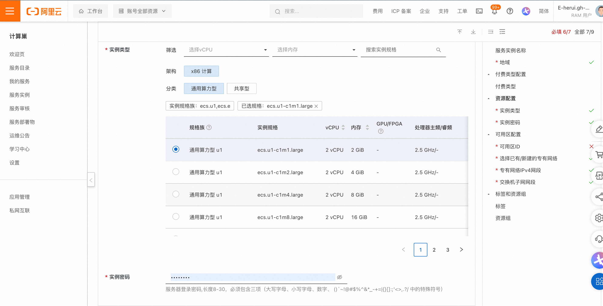
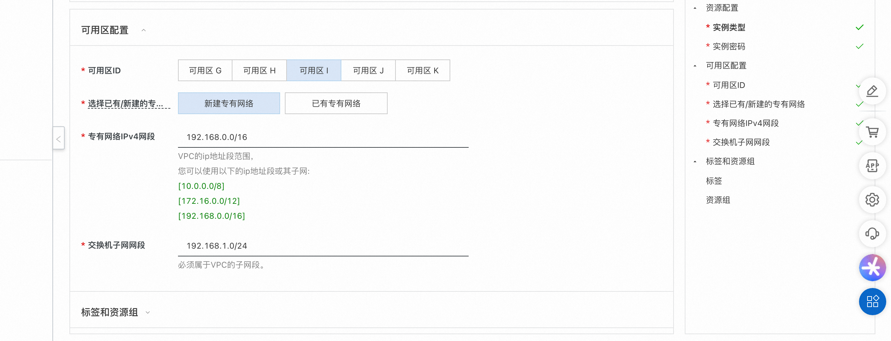
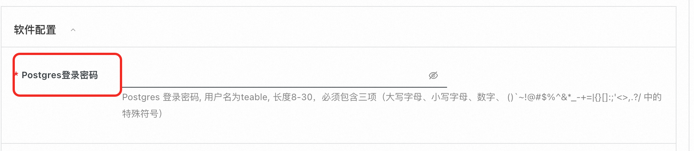
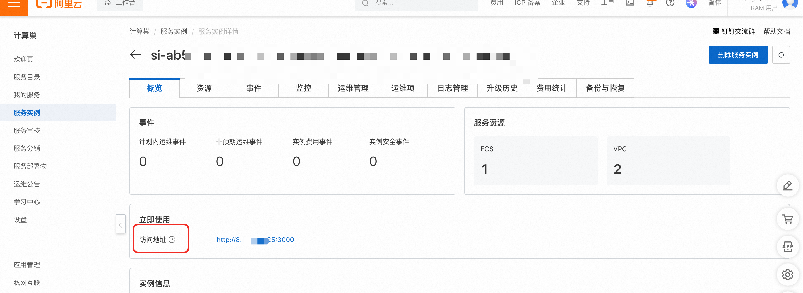
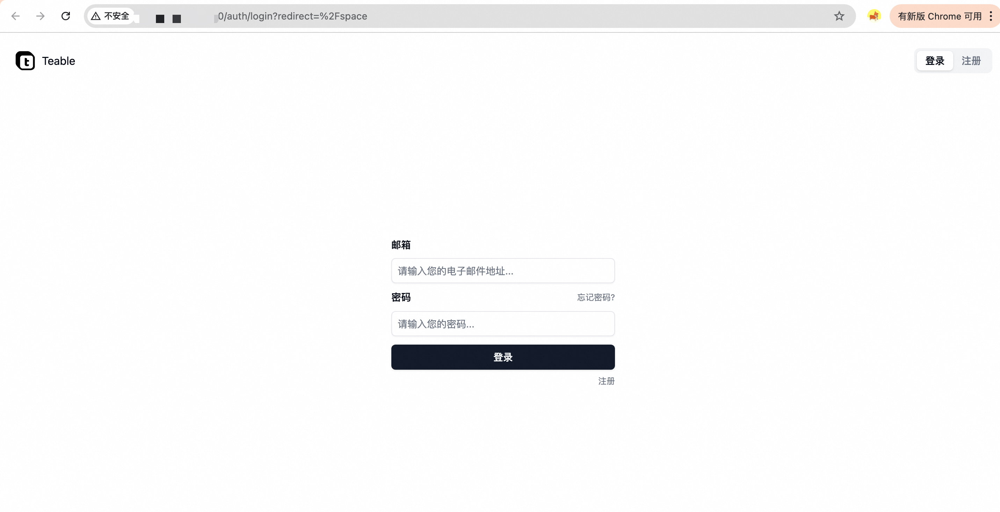

<h1>Teable Community Edition Deployment Document </h1>

<h2> Overview </h2>

Teable is an enterprise-class high-performance multi-dimensional table solution that quickly builds business management systems without code, supporting private deployment and granular permission management. 

 The platform provides real-time collaboration, automated workflow and unlimited number of rows expansion, providing enterprises with a safe, controllable, stable and reliable data management platform. It is a private deployment alternative to flying book multi-dimensional tables. 

 Please refer to the official document: https://help.teable.cn/

<h2> Billing instructions </h2>

 The cost of the Teable Community Edition on the computing nest mainly involves:

 the selected vCPU and memory specifications disk capacity public network bandwidth billing methods include:

<ul>
<li> Pay-As-You-Go (hourly)</li>
<li> The estimated annual and monthly fees can be seen in real time when the instance is created. </li>
</ul>

 The estimated cost is visible in real time when the instance is created. 

<h2> Deployment Architecture </h2>

Teable Community Edition is a stand-alone deployment architecture and is deployed independently based on Docker Compose.

<h2> Permissions required for RAM accounts </h2>

 The Teable Community Edition service needs to access and create resources such as ECS and VPC. If you use a RAM user to create a service instance, you need to add the corresponding resource permissions to the account of the RAM user before creating the service instance. For details about how to add RAM permissions, see Authorize RAM users. The required permissions are shown in the following table. 

<table>
<thead>
<tr>
<th> Permission policy name </th>
<th> Remarks </th>
</tr>
</thead>
<tbody>
<tr>
<td>AliyunECSFullAccess</td>
<td> Permissions to manage ECS </td>
</tr>
<tr>
<td>AliyunVPCFullAccess</td>
<td> Permissions for managing VPC networks </td>
</tr>
<tr>
<td>AliyunROSFullAccess</td>
<td> Manage permissions for Resource Orchestration Services (ROS) </td>
</tr>
<tr>
<td>AliyunComputeNestUserFullAccess</td>
<td> Manage user-side permissions for the compute nest service (ComputeNest) </td>
</tr>
<tr>
<td>AliyunCloudMonitorFullAccess</td>
<td> Permissions to manage CloudMonitor (CloudMonitor) </td>
</tr>
</tbody>
</table>

<h2> Deployment process </h2>

<h3> Deployment steps </h3>

<ol>
<li> Click <a href = "https://computenest.console.aliyun.com/service/instance/create/default?type=user&ServiceName=Teable社区版"> Deployment Link </a> to go to the Service Instance Deployment page. </li>
<li> according to the interface prompt, fill in the parameters to complete the deployment.
Select a resource type and configure an ECS instance password.

Configure the zone. You can create a new VPC or use an existing VPC.
</li>
<li> Configure the teable password for the Postgres database. The user name is teable.
</li>
<li> After setting the parameters, click Next to confirm the order, click Create Now, and wait for the service instance to be created. </li>
<li> After the service instance is created, go to the service instance details page. On the Overview page, you can obtain the login information of Teable.

<h3> Validation results </h3></li>
</ol>

 Click the link to go to Teable's console and follow the prompts to get started.

<footer>

 View more computing nest services (https://computenest.aliyun.com)

</footer>

